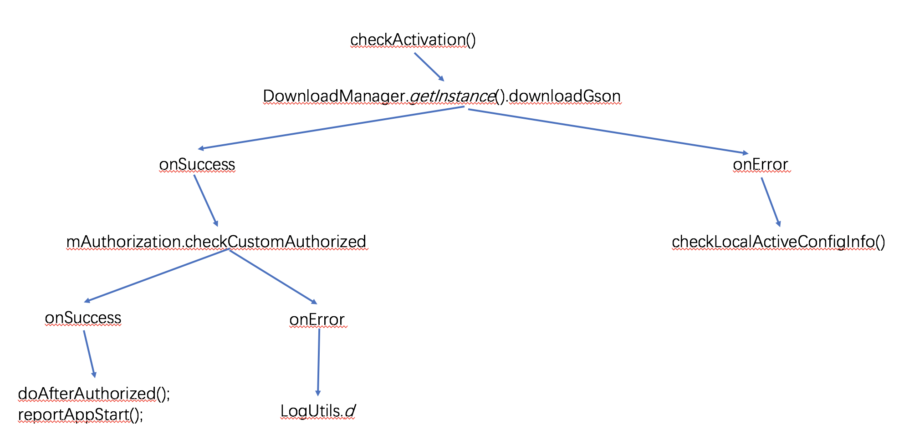

# 第一个回调函数总结

## 目的

验证客户是否过期，如果过期则弹出提醒”授权已过期“的弹框，否则则继续接下去的流程。主要逻辑如下，




## 步骤

1. 新建一个抽象类，实现 onCheckCustomAuthorizedCallback 接口；

```
public abstract static class onCheckCustomAuthorizedCallback{
    /**
     * Called when response success.
     */
    public abstract void  onSuccess(JSONObject response);

    /**
     * Callback method that an error has been occurred.
     */
    public abstract void  onError(int error_code);
}
```

2. 实现自己想要实现的方法，比如请求 api 接口，验证用户是否已经过期；

```
public void checkCustomAuthorized(final onCheckCustomAuthorizedCallback callback,
                                  final AlertDialog dialog)
{

    String userType = "1";
    String url = ApiDomain.getAuthorizeInfo() + "?customId=" + Config.getCustomId() + "&userType=" + userType;


    DownloadManager.getInstance().downloadJson(url, new DownloadManager.OnCommonDownloadCallback<JSONObject>() {
        @Override
        public void onSuccess(JSONObject response) {
            LogUtils.d(TAG, "getAuthorizeInfo onSuccess:" + response);

            try {
                LogUtils.d(TAG, "[checkCustomAuthorized] onSuccess: 1");
                int errorCode = response.getInt("error_code");
                if (errorCode == -115) { // 如果是 authorization is expired!
                    dialog.show();
                } else if (errorCode == 0) {
                    LogUtils.d(TAG, "[checkCustomAuthorized] onSuccess:");
                }

            } catch (Exception e) {
                LogUtils.d(TAG, e.toString());
            }
        }
    });
```

3. 将上述二者包装成一个类，因为此处还需要弹框通知，所以另外加了一个实例域，代码如下，

```
public class Authorization{

    public static final String TAG = "Authorization";
    public AlertDialog dialog;

    public AlertDialog getAlertDialog(Context context){

        dialog = new AlertDialog.Builder(context).setTitle("普通对话框").setIcon(R.drawable.app_icon)
                .setMessage("授权已过期，请联系学校管理员！").create();
        dialog.setCanceledOnTouchOutside(false);

        return dialog;

    }

    public abstract static class onCheckCustomAuthorizedCallback{
        /**
         * Called when response success.
         */
        public abstract void  onSuccess(JSONObject response);

        /**
         * Callback method that an error has been occurred.
         */
        public abstract void  onError(int error_code);
    }


    public void checkCustomAuthorized(final onCheckCustomAuthorizedCallback callback,
                                      final AlertDialog dialog)
    {

        String userType = "1";
        String url = ApiDomain.getAuthorizeInfo() + "?customId=" + Config.getCustomId() + "&userType=" + userType;


        DownloadManager.getInstance().downloadJson(url, new DownloadManager.OnCommonDownloadCallback<JSONObject>() {
            @Override
            public void onSuccess(JSONObject response) {
                LogUtils.d(TAG, "getAuthorizeInfo onSuccess:" + response);

                try {
                    LogUtils.d(TAG, "[checkCustomAuthorized] onSuccess: 1");
                    int errorCode = response.getInt("error_code");
                    if (errorCode == -115) { // 如果是 authorization is expired!
                        dialog.show();
                    } else if (errorCode == 0) {
                        LogUtils.d(TAG, "[checkCustomAuthorized] onSuccess:");
                    }

                } catch (Exception e) {
                    LogUtils.d(TAG, e.toString());
                }
            }
        });

    }

}
```

4. 调用该方法，并设置回调接口。

```
public class MainActivity extends BaseActivity{
		private Authorization mAuthorization = new Authorization();
    private  AlertDialog dialog;
    
    private void checkActivation(){
        String url = ApiDomain.getActivateInfoUrl() + "?deviceId=" + BaseApplication.getSerialNum();
        DownloadManager.getInstance().downloadGson(url, new TypeToken<APIObjectBean<CheckActiveInfo>>() {
        }.getType(), new DownloadManager.OnObjectDownloadCallback<CheckActiveInfo>() {
            @Override
            public void onSuccess(CheckActiveInfo response) {
                Config.setCustomId(response.getCustomId());
                Config.setDeviceName(response.getName());
                dialog = mAuthorization.getAlertDialog(MainActivity.this);
                mAuthorization.checkCustomAuthorized(new Authorization.onCheckCustomAuthorizedCallback() {
                    @Override
                    public void onSuccess(JSONObject response) {
                        doAfterAuthorized();
                        reportAppStart();
                    }

                    @Override
                    public void onError(int error_code) {
                        LogUtils.d(TAG, "[activeSelf]: " +error_code);
                    }
                }, dialog);
            }

            @Override
            public void onError(int error_code, String error_msg) {
                if (error_code == -101) { // 如果是device is not activated!
                    checkLocalActiveConfigInfo();
                }
            }
        });
    }
}
```