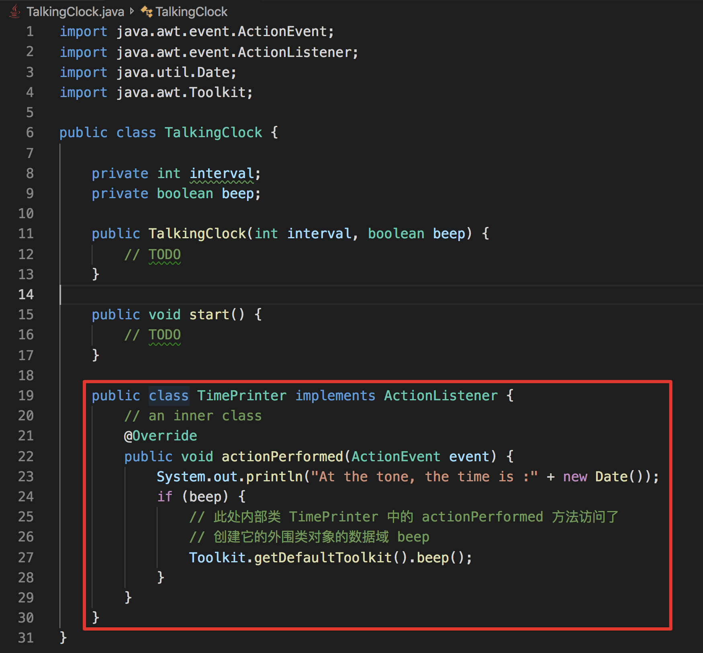
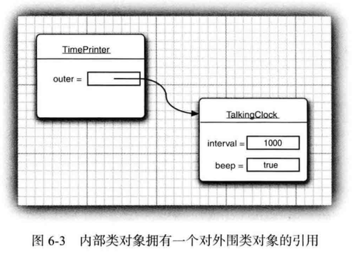

# 内部类

## 使用内部类的原因

- 内部类方法可以访问其定义所在的作用域中的数据，包括私有的数据；（待解释）
- 内部类可以对同一个包中的其他类隐藏；
- 当想要实现一个回调函数且保证代码量小的情况下，使用**匿名内部类**比较方便；


## 目录

1. 介绍一个简单内部类，并实现它访问外围类的实例域的能力；
2. 介绍内部类的特殊语法规则；
3. 介绍内部类的内部，探讨如何将其转换成常规类；
4. 介绍局部内部类，局部内部类可以访问外围作用域中的局部变量；
5. 介绍匿名内部类，并用其实现回调的基本方法；
6. 介绍如何将静态内部类嵌套在辅助类中；


## 使用内部类访问对象状态

举一个例子，分析 TimerTest 示例， 并抽象出一个 TalkingClock 类。 构造一个语音时钟时需要提供两个参数：发布通告的间隔和开关铃声的标志。



为了运行这个程序，内部类的对象总有一个隐式引用，它指向了创建它的外部类对象。




## 内部类的特殊语法规则

使用外围类的正规语法，**OuterClass.this** 表示外围类引用。


反过来，可以采用下列语法格式更加明确地编写内部对象的构造器，`outerObject.new InnerClass(construction parameters)`，举个例子，

`ActionListener listener = this.new TimePrinter()`

通常情况下，this 限定词都是多余的。不过，还可以通过显示地命名将外围类引用设置为其他的对象。举个例子，假如 TimePrinter 是一个公有内部类，对于任意一个语音时钟都可以构造一个 TimePrinter：

```TalkingClock jabberer = new TalkingClock(1000, true);
TalkingClock jabberer = new TalkingClock(1000, true);
TalkingClock.TimePrinter listener = jabberer.new TimePrinter();
```

 **Note**：

- 内部类中声明的所有静态域都必须是 final；
- 内部类不能有 static 方法；
- 内部类只能访问外围类的静态域和方法；


## 内部类是否有用、必要和安全


### 局部内部类

如果某个类只在某个方法中创建这个类型的对象时使用一次，那么此时我们可以选择在这个方法中定义一个局部内部类。


**Note**：

- 局部内部类不能用 public 或 private 说明符进行声明；
- 局部内部类有一个又是，就是对外部世界可以完全地隐藏起来。即使 TalkingClock 类中的其他代码也不能访问它。除了 start 方法之外，没有任何方法知道 TimePrinter 类的存在。


### 由外部方法访问变量

由上述描述我们可以知道，局部内部类可以访问包含它们的外部类，此外局部内部类还可以访问局部变量。但是，那些局部变量事实上必须申明为final，即一旦赋值就不会改变。


在上面这个例子中，我们将 TalkingClock 构造器的参数 int interval, boolean beep 移动到了 start 方法中去。 这时候 TalkingClock 类不再需要存储实例变量 beep 了，它只是引用 start 方法中的 beep 变量。

仔细思考一下这里面的控制流程。

1. 调用 start 方法；
2. 调用内部类 TimePrinter 的构造器，以便初始化对象变量 listener；
3. 将 listener 引用传递给 Timer 构造器，定时器开始计时，start 方法结束。此时，start 方法的 beep参数变量不复存在；
4. 然后，actionPerformed 方法执行 if (beep)。

那么为了能够实现步骤4，**TimePrinter 类在 beep 域释放之前将 beep 域用 start 方法的局部变量进行备份**。

在这里用反射的方法来看一下结果，


当我们创建一个对象的时候，beep就会被传递给构造器，并存储在val$beep中。编译器必须检测对局部变量的访问，为每一个变量建立相应的数据域，并将局部变量拷贝到构造器中，以便将这些数据域初始化为局部变量的副本。


### 匿名内部类

匿名内部类：只创建这个类的 **一个** 对象，就不必命名了。


如果构造参数的闭小括号后面跟一个开大括号，正在定义的就是匿名内部类。

通常情况下的习惯做法是，用匿名内部类实现事件监听器和其他回调。如今最好还是使用 lambda 表达式。


#### 利用匿名内部类进行双括号初始化

例子，假设你想构造一个数组列表，并将它传递到一个方法，


#### 匿名内部类在生成日志或调试消息时的用法

一般生成日志或调试消息时，通常希望包含当前类的类名，如，

`System.err.println("Something awful happened in :" + getClass());`

但是，这种方法对于静态方法不奏效。因为，调用 getClass 时调用的是 this.getClass，而静态方法没有 this。此时可以使用以下表达式：

`new Object(){}.getClass().getEnclosingClass();`

在这条语句中`new Object(){}`会建立 Object 的一个匿名子类的一个匿名对象，getEnclosingClass()则得到其外围类，也就是包含这个静态方法的类。


### 静态内部类

当我们使用内部类只是为了把一个类隐藏在另外一个类内部，且不需要内部类引用外围类对象时，我们可以考虑使用静态内部类。

举个例子，我们打算计算数组中的最大值和最小值，使用只遍历数组一次的方法，同时计算出最小值和最大值。 


