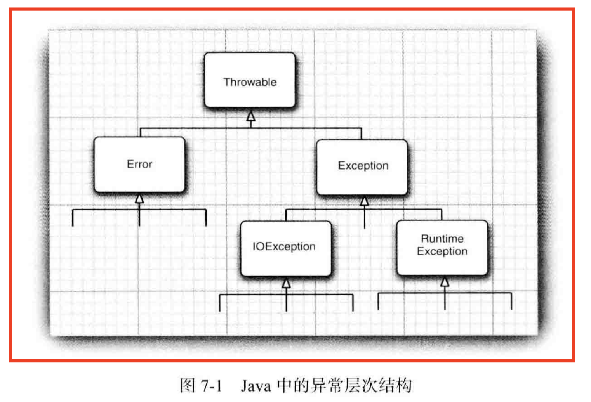

# 异常

## 7.1 处理错误

错误的种类，

- 用户输入错误；
- 设备错误；
- 物理限制；
- 代码错误；

### 7.11 异常分类

在 Java 程序设计语言中， 异常对象都是派生于 Throwable 类的一个实例。

Throwable

- Error（非受查异常）：Java 运行时系统的**内部错误**和**资源耗尽错误**
- Exception
  - RuntimeException（非受查异常）：由程序错误导致的异常属于RuntimeException
    - 错误的类型转换
    - 数组访问越界
    - 访问 null 指针
  - 其他异常：程序本身没有问题，但由于像I/O错误这类问题导致的异常
    - 视图在文件尾部后面读取数据
    - 试图打开一个不存在的文件
    - 试图根据给定的字符串查找 Class 对象，而这个字符串表示的类并不存在

”**如果出现 RuntimeException 异常， 那么就一定是你的问题**” 是一条相当有道理的规则。 应该通过检测数组下标是否越界来避免 ArraylndexOutOfBoundsException 异常; 应该通过在使用变量之前检测是否为 null 来杜绝 NullPointerException 异常的发生。

### 7.1.2 声明非受查异常

需要记住遇到下面4种情况时应该抛出异常，

- 调用一个抛出受查异常的方法，例如，FileInputStream 构造器；
- 程序运行过程中发现错误，并且利用 throw 语句抛出一个受查异常；
- 程序出现错误，比如，a[-1] = 0 会抛出一个 ArrayIndexOutOfBoundsException 这样的非受查异常；
- Java 虚拟机和运行时库出现的内部错误；

总之， 一个方法必须声明**所有可能抛出的受查异常**， 而非受查异常要么不可控制(Error), 要么就应该避免发生(RuntimeException)。如果方法没有声明所有可能发生的受查异常， 编译器就会发出一个错误消息。 

当然， 从前面的示例中可以知道: 除了声明异常之外， 还可以**捕获异常**。这样会使异常不被抛到方法之外， 也不需要 throws 规范。稍后， 将会讨论如何决定一个异常是被捕获， 还是被抛出让其他的处理器进行处理。 

**Warning**：如果在子类中覆盖了超类的一个方法， 子类方法中声明的受查异常不能比超类方法中声明的异常更通用。

### 7.1.3 如何抛出异常

对于一个已经存在的异常类，将其抛出异常非常容易。我们可以，

1. 找到一个合适的异常类；
2. 创建这个类的一个对象；
3. 将对象抛出；

### 7.1.4 创建异常类

在程序中， 可能会遇到任何标准异常类都没有能够充分地描述清楚的问题。 在这种情况下，创建自己的异常类就是一件顺理成章的事情了。我们需要做的只是**定义一个派生于 Exception 的类**， 或者**派生于 Exception 子类的类**。 例如， 定义一个派生于 IOException 的类。习惯上， 定义的类应该包含**两个构造器**， **一个是默认的构造器**；**另一个是带有详细描述信息的构造器**(超类 Throwable 的 toString 方法将会打印出这些详细信息， 这在调试中非常有用)。

`class FileFormatException extends IOException {
	public FileFormatException {}
	public FileFormatException(String gripe) {`

`				super(gripe) ;
	}
}`

## 7.2 捕获异常

### 7.2.1 捕获异常

要想捕获一个异常， 必须设置 try/catch 语句块。最简单的 try 语句块如下所示：

`try {`

`code `

`more code`

`more code`

`} catch (ExceptionType e) {`

`handler for this type`

`}`

如果在 try 语句块中的任何代码抛出了一个在 catch 子句中说明的异常类， 那么

1. 程序将跳过 try 语句块的其余代码；
2. 程序将执行 catch 子句中的处理器代码；

### 7.2.2 捕获多个异常

在一个 try 语句块中可以捕获多个异常类型， 并对不同类型的异常做出不同的处理。 可以按照下列方式为每个异常类型使用一个单独的 catch 子句：

`try {`

`code that might throw exceptions `

`} catch (FileNotFoundException e) {
emergencyactionfor missingfiles `

`} catch (UnknownHostException e) {`

`emergency action for unknown hosts
} catch (IOException e) {
emergencyactionforall other I/O problems`

}

要想获得对象的更多信息， 可以试着使用

`e.getMesssage()`

得到详细的错误信息(如果有的话，) 或者使用

`e.getClass().getName()`

得到异常对象的实际类型。

在 Java SE 7 中， 同一个 catch 子句中可以捕获多个异常类型。 例如， 假设对应缺少文件和未知主机异常的动作是一样的， 就可以合并 catch 子句：

`try {`

`code that might throws exceptions`

}`catch (FileNotFoundException | UnknownHostException e) {`

`emergency action for missing files and unknown hosts 
} catch (IOException e) {`

`emergency action for all other I/O problems`

`}`

**Note**：捕获多个异常时， 异常变量隐含为 final 变量。

### 7.2.3 再次抛出异常与异常链

在 catch 子句中可以抛出一个异常， 这样做的目的是改变异常的类型。x

下面给出了捕获异常并将它再次抛出的基本方法，

`try {`

`			access the database`

`} catch (SQLException e) {`

`		throw new ServeletException("database error:" + e.getMessage())`

`};`

不过，可以有一种更好的处理方法，并且将原始异常设置为新异常的“原因”：

`try {`

`access the dataset`

`} catch (SQLException e) {`

`Throwable se = new ServeletException("database error");`

`se.initCause(e);`

`throw se;`

`}`

当捕获到异常时， 就可以使用下面这条语句重新得到原始异常：

`Throwable e = se.getCause();`

强烈建议使用这种包装技术。这样可以让用户抛出子系统中的高级异常， 而不会丢失原始异
常的细节。

### 7.2.4 finally 子句

不管是否有异常被捕获， finally 子句中的代码都被执行。 在下面的示例中， 程序将在所有情况下关闭文件。事实上， 我们认为在需要关闭资源时， 用这种方式使用 finally 子句是一种不错的选择。

### 7.2.6 分析堆栈轨迹元素

- 可以调用 Throwable 类的 printStackTrace 方法访问堆栈轨迹的文本描述信息。
- 一种更灵活的方法是使用 getStackTrace 方法， 它会得到 StackTraceElement 对象的一个数组， 可以在你的程序中分析这个对象数组。
- 静态的 Thread.getAllStackTrace 方法， 它可以产生所有线程的堆栈轨迹 。

## 7.3 使用异常机制的技巧

1. 异常处理不能代替简单的测试；
2. 不要过分地细化异常；
3. 利用异常层次结构；
4. 不要压制异常；
5. 在检测错误时，“苛刻”要比放任更好；
6. 不要羞于传递异常；

